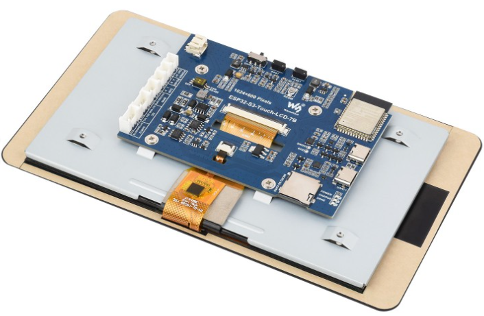
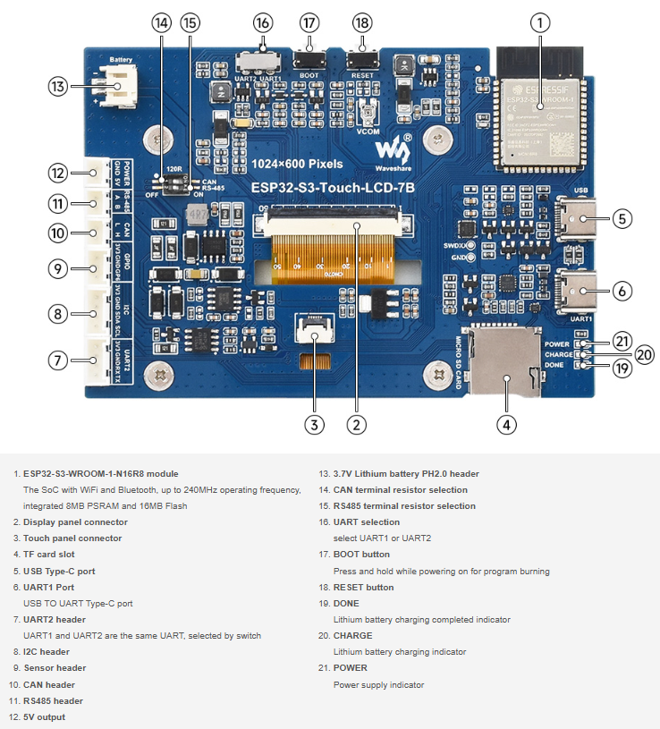

# ESP32-S3 Ecowitt Display

Display tactil de 7" para estacion meteorologica Ecowitt. Muestra en tiempo real los datos de tu propia estacion via API REST.

## Caracteristicas

- **Pantalla tactil 7" IPS** a color (1024x600)
- **Datos en tiempo real** de tu estacion Ecowitt
- **6 paneles grandes** - Temperatura, Humedad, Viento, Presion, Lluvia, Sol/Luna
- **Tema claro/oscuro** - Estilo servidor web
- **Interior + Exterior** - BME280 local + sensores de la estacion
- **Alertas activas** - Muestra si hay alertas disparadas
- **UI con LVGL 8.3** - Interfaz moderna y fluida
- **Configuracion tactil** - WiFi y ajustes en pantalla

## Hardware

### Waveshare ESP32-S3-Touch-LCD-7B

| Especificacion | Valor |
|----------------|-------|
| Display | 7" IPS LCD, 1024x600 pixeles |
| Touch | GT911 capacitivo multi-touch |
| CPU | ESP32-S3 dual-core @ 240MHz |
| Flash | 16MB |
| PSRAM | 8MB (OPI mode) |
| WiFi | 802.11 b/g/n 2.4GHz |
| USB | Type-C (CDC + JTAG) |

<p align="center">
  
</p>

<p align="center">
  
</p>

### Diagrama de componentes

<p align="center">
  
</p>

**Componentes principales:**
1. ESP32-S3-WROOM-1-N16R8 (WiFi/BT, 8MB PSRAM, 16MB Flash)
2. Conector panel display
3. Conector panel touch
4. Slot tarjeta TF/SD
5. Puerto USB Type-C
6. UART1 Port
8. Header I2C
9. Header sensores
17. Boton BOOT
18. Boton RESET

### Sensor interior (opcional)

| Sensor | Conexion |
|--------|----------|
| BME280 | I2C (GPIO 8/9) |
| Direccion | 0x76 o 0x77 |

## Conexion

El display se conecta a tu servidor Ecowitt via WiFi:

```
┌─────────────────────┐         ┌─────────────────────┐
│  Display 7" tactil  │  WiFi   │  Servidor Ecowitt   │
│  ESP32-S3 + LVGL    │ <-----> │  clima.xe1e.net     │
│                     │  HTTPS  │  /api/current       │
└─────────────────────┘         └─────────────────────┘
```

## API Endpoints

```
GET /api/current      - Datos actuales (temp, humedad, viento, lluvia, UV...)
GET /api/stats/daily  - Estadisticas del dia (max, min, totales)
GET /api/compare      - Comparacion vs ayer
GET /api/alerts       - Alertas activas
GET /api/almanac      - Sol, luna, planetas
```

## Configuracion Arduino IDE

| Setting | Valor |
|---------|-------|
| Board | ESP32S3 Dev Module |
| USB CDC On Boot | Enable |
| Flash Size | 16MB (128Mb) |
| Flash Mode | QIO 80MHz |
| PSRAM | OPI PSRAM |
| Partition Scheme | 16M Flash (3M APP/9.9MB FATFS) |

## Librerias requeridas

| Libreria | Version | Notas |
|----------|---------|-------|
| esp32 (Espressif) | 2.0.17+ | Board Manager (NO usar 3.x) |
| lvgl | 8.3.x | **NO usar 9.x** |
| GFX Library for Arduino | 1.3.7 | **Esta version exacta** |
| ArduinoJson | 6.x o 7.x | Parser JSON |
| Adafruit BME280 | Latest | Sensor interior (opcional) |
| GT911 Lite | 1.0.2 | Touch controller |

## Instalacion

1. Clona este repositorio
2. Abre `ESP32-S3-Ecowitt-Display.ino` en Arduino IDE
3. Copia `my_config.h.template` a `my_config.h`
4. Edita `my_config.h` con tu WiFi y URL de API
5. Copia `lv_conf.h` a tu carpeta `Arduino/libraries/`
6. Compila y sube al ESP32-S3

## Configuracion inicial

Al primer arranque aparece el wizard de configuracion:
1. Selecciona tu red WiFi
2. Ingresa la contrasena
3. Configura la URL de tu servidor Ecowitt
4. El display reinicia y comienza a mostrar datos

## Estructura del proyecto

```
ESP32-S3-Ecowitt-Display/
├── ESP32-S3-Ecowitt-Display.ino   # Archivo principal
├── config.h                        # Estructuras de datos
├── my_config.h                     # Tu configuracion (gitignore)
├── my_config.h.template            # Plantilla de configuracion
│
├── display.h                       # Inicializacion display RGB
├── touch.h                         # Driver touch GT911
├── ecowitt_api.h                   # Cliente API REST
├── preferences_manager.h           # Persistencia NVS
├── bme280_sensor.h                 # Sensor interior
│
├── ui_dashboard.h                  # Pantalla principal (6 cards)
├── ui_navigation.h                 # Navegacion y swipe
├── ui_wizard.h                     # Wizard de configuracion
│
├── lv_conf.h                       # Config LVGL (copiar a libraries/)
│
├── docs/
│   ├── README.md                   # Indice de documentacion
│   ├── TODO.md                     # Tareas pendientes
│   ├── DEVELOPMENT_PLAN.md         # Plan de desarrollo
│   └── archivo/                    # Docs obsoletos
│       ├── PLAN.md
│       └── DEV_STATUS.md
│
└── unused_waveshare/               # Codigo original Waveshare (referencia)
```

## Notas tecnicas

- **I2C:** GPIO 8 (SDA), GPIO 9 (SCL) - NO 19/20
- **Touch INT:** GPIO 4 (LOW = touch activo)
- **Pixel clock:** 15 MHz (estable, sin tearing)
- **Buffer LVGL:** 200 lineas en PSRAM
- **Fuentes:** Montserrat 12-48px

## Licencia

MIT

---

Proyecto complementario de [Ecowitt Weather Server XE1E](https://github.com/XE1E/ecowitt-weather-server-xe1e)
